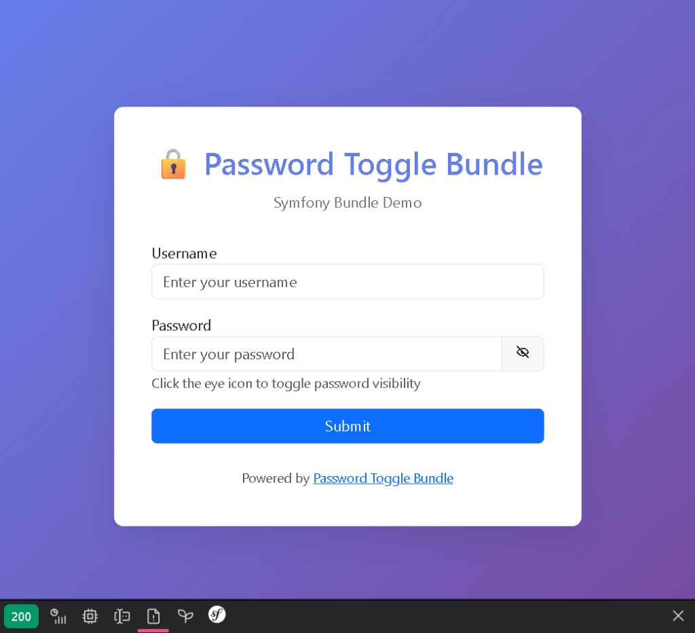

# Password Toggle Bundle


FrankenPHP worker mode: supported (PHPStan FrankenPHP rules + Symfony demos with `FRANKENPHP_MODE=worker`).

[](https://github.com/nowo-tech/PasswordToggleBundle/actions/workflows/ci.yml) [](https://packagist.org/packages/nowo-tech/password-toggle-bundle) [](https://packagist.org/packages/nowo-tech/password-toggle-bundle) [](LICENSE) [](https://php.net) [](https://symfony.com)

> ⭐ **Found this useful?** Give it a star on GitHub! It helps us maintain and improve the project.

Symfony bundle providing a password form type with toggle visibility feature.



## Documentation

- [GitHub Actions CI requirements](docs/GITHUB_CI.md)
- [Installation](docs/INSTALLATION.md)
- [Configuration](docs/CONFIGURATION.md)
- [Usage](docs/USAGE.md)
- [Contributing](docs/CONTRIBUTING.md)
- [Code of Conduct](CODE_OF_CONDUCT.md)
- [Changelog](docs/CHANGELOG.md)
- [Upgrading](docs/UPGRADING.md)
- [Release](docs/RELEASE.md)
- [Security](docs/SECURITY.md)
- [Engram](docs/ENGRAM.md)
- [Spec-driven development](docs/SPEC-DRIVEN-DEVELOPMENT.md)
- [GitHub Spec Kit](docs/SPEC-KIT.md)

### Additional documentation

- [Demo with FrankenPHP (development and production)](docs/DEMO-FRANKENPHP.md)
- [Overriding bundle templates](docs/USAGE.md#overriding-bundle-templates)
- [Branching](docs/BRANCHING.md)

## Features

- ✅ Password form type with toggle visibility
- ✅ Customizable icons and labels
- ✅ **No Stimulus / no extra asset bundle** — toggle uses **inline** `onclick` / `onkeydown` (see `toggle_password_widget.html.twig`) for compatibility with Live Components
- ✅ Icons via **`symfony/ux-icons`** + **`symfony/http-client`** (Flex recipe installs both; graceful fallback + log warning if missing)
- ✅ Fully configurable CSS classes
- ✅ Works with Live Components
- ✅ Accessibility support (ARIA labels, keyboard navigation)
- ✅ Configuration validation with clear error messages
- ✅ Type validation for all options
- ✅ Can be disabled per field (renders simple password input)
- ✅ Symfony Flex recipe for automatic installation (ux-icons + http-client + icon assets from recipe **1.2.3+**)

## Installation

```bash
composer require nowo-tech/password-toggle-bundle
```

Then, register the bundle in your `config/bundles.php`:

```php
<?php

return [
  // ...
  Nowo\PasswordToggleBundle\NowoPasswordToggleBundle::class => ['all' => true],
];
```

> **Note**: If you're using Symfony Flex, the bundle will be registered automatically and a default configuration file will be created at `config/packages/nowo_password_toggle.yaml`.

## Configuration

When installed via Symfony Flex, a default configuration file is automatically created at `config/packages/nowo_password_toggle.yaml`. If you're not using Flex or the file wasn't created, you can create it manually.

You can configure default values for all password fields in `config/packages/nowo_password_toggle.yaml`:

```yaml
nowo_password_toggle:
  toggle: true
  visible_icon: 'tabler:eye-off'
  hidden_icon: 'tabler:eye'
  visible_label: 'Show'
  hidden_label: 'Hide'
  button_classes: ['input-group-text', 'cursor-pointer']
  toggle_container_classes: ['form-password-toggle']
  use_toggle_form_theme: true
  always_empty: true
  trim: false
  invalid_message: 'The password is invalid.'
```

These defaults will be used for all `PasswordType` instances unless overridden when using the form type directly.

## Usage

### Basic Usage

```php
use Nowo\PasswordToggleBundle\Form\Type\PasswordType;

$builder->add('password', PasswordType::class);
```

### With Options

```php
$builder->add('password', PasswordType::class, [
  'toggle' => true,
  'visible_icon' => 'tabler:eye-off',
  'hidden_icon' => 'tabler:eye',
  'visible_label' => 'Show',
  'hidden_label' => 'Hide',
  'button_classes' => ['input-group-text', 'cursor-pointer'],
  'toggle_container_classes' => ['form-password-toggle'],
]);
```

### Available Options

All options can be configured globally in `config/packages/nowo_password_toggle.yaml` or overridden per field when using the form type.

**Note**: All options are validated for correct types. Invalid values will throw exceptions with clear error messages.

| Option | Type | Default | Description |
|--------|------|---------|-------------|
| `toggle` | `bool` | `true` | Enable/disable toggle functionality. When `false`, renders a simple password input without toggle button |
| `visible_icon` | `string` | `'tabler:eye-off'` | Icon when password is hidden (must be non-empty) |
| `hidden_icon` | `string` | `'tabler:eye'` | Icon when password is visible (must be non-empty) |
| `visible_label` | `string` | `'Show'` | Label when password is hidden (must be non-empty) |
| `hidden_label` | `string` | `'Hide'` | Label when password is visible (must be non-empty) |
| `button_classes` | `array` | `['input-group-text', 'cursor-pointer']` | CSS classes for toggle button (must be an array) |
| `toggle_container_classes` | `array` | `['form-password-toggle']` | CSS classes for container (must be an array) |
| `use_toggle_form_theme` | `bool` | `true` | Use the bundle's form theme for rendering |
| `always_empty` | `bool` | `true` | Always render empty value |
| `trim` | `bool` | `false` | Trim whitespace |
| `invalid_message` | `string` | `'The password is invalid.'` | Invalid message (must be non-empty) |

### Disabling Toggle

You can disable the toggle functionality for a specific field:

```php
$builder->add('password', PasswordType::class, [
  'toggle' => false, // Renders a simple password input without toggle button
]);
```

When `toggle` is `false`, the field renders as a standard password input without the toggle button, making it compatible with any styling or JavaScript framework.

## Requirements

- PHP >= 8.2, < 8.6
- Symfony >= 7.0 || >= 8.0
- **Symfony UX Icons** `^2.0 || ^3.0` and **symfony/http-client** (same Symfony major) — **required for the default Twig template** (`ux_icon()`). Listed as `composer suggest` on the bundle; Symfony Flex adds both via the recipe. Without Flex:

```bash
composer require symfony/ux-icons symfony/http-client
php bin/console ux:icons:lock
```

If those packages are missing, the toggle still works but icons are omitted; see [docs/INSTALLATION.md](docs/INSTALLATION.md#missing-icon-packages-runtime-behaviour).
- Bootstrap 5 (recommended for styling, but not required)

## Styling

The bundle includes CSS/SCSS styles for the toggle button. You can use them by:

### Option 1: Include the CSS file

```html
<link rel="stylesheet" href="{{ asset('css/toggle_password.css', 'nowo_password_toggle') }}">
```

### Option 2: Use the SCSS file

If you're using a build system (Webpack Encore, Vite, etc.), import the SCSS:

```scss
@import '@nowo-tech/password-toggle-bundle/src/Resources/public/css/toggle_password.scss';
```

### Option 3: Custom styles

The bundle uses these CSS classes that you can style:
- `.input-group.input-group-merge` - Container
- `.input-group-text.cursor-pointer` - Toggle button
- `.icon-base` - Icon classes

Example custom styles:

```css
.input-group-text.cursor-pointer {
 cursor: pointer;
 user-select: none;
 transition: all 0.2s ease-in-out;
}

.input-group-text.cursor-pointer:hover {
 background-color: var(--bs-secondary-bg, #f8f9fa);
}

.input-group-text.cursor-pointer:active {
 transform: scale(0.95);
}

.input-group-text.cursor-pointer:focus-visible {
 outline: 2px solid var(--bs-primary, #696cff);
 outline-offset: 2px;
}
```

## Demo Projects

The bundle includes three demo projects demonstrating usage with different Symfony and PHP versions:

- **Symfony 7.0 Demo** (PHP 8.2) - Port 8001 (default, configurable via `.env`)
- **Symfony 8.0 Demo** (PHP 8.4) - Port 8001 (default, configurable via `.env`)
- **Symfony 8.0 Demo with PHP 8.5** - Port 8001 (default, configurable via `.env`)

Each demo is independent and includes:
- Complete Docker setup with FrankenPHP (HTTP on port 80). With **`APP_ENV=dev`** (default), the image **entrypoint uses `Caddyfile.dev`** (no FrankenPHP worker, comfortable local dev). **FrankenPHP worker mode is supported and tested** in production demo configuration; see [docs/DEMO-FRANKENPHP.md](docs/DEMO-FRANKENPHP.md).
- Comprehensive test suite
- Port configuration via `.env` file
- Symfony Web Profiler for debugging (dev and test environments)
- Properly configured routing with attribute-based routes
- Bundle configuration file (`config/packages/nowo_password_toggle.yaml`) demonstrating global configuration (v1.2.0+)

### Quick Start with Docker

```bash
cd demo
make up-symfony7    # Start Symfony 7.0 demo (specific command)
# Or use generic command: make up symfony7
make install-symfony7  # Install dependencies
# Or use generic command: make install symfony7
# Access at: http://localhost:8001 (default port, configurable via .env)
```

Or start any other demo:

```bash
# Using specific commands
make up-symfony8    # Symfony 8.0
make up-symfony8-php85 # Symfony 8.0 with PHP 8.5

# Or using generic commands with demo name
make up symfony8    # Symfony 8.0
make up symfony8-php85 # Symfony 8.0 with PHP 8.5
```

See `demo/README.md` for detailed instructions for all demos.

## Development

### Using Docker (Recommended)

```bash
# Start the container
make up

# Install dependencies
make install

# Run tests
make test

# Run tests with coverage
make test-coverage

# Run all QA checks
make qa
```

### Without Docker

```bash
composer install
composer test
composer test-coverage
composer qa
```

## Testing

The bundle targets **≥95% code coverage** (CI minimum); current suite is at 100%. All tests are located in the `tests/` directory.

### Running Tests

```bash
# Run all tests
composer test

# Run tests with coverage report
composer test-coverage

# View coverage report
open coverage/index.html
```

### Test Structure

- `tests/Unit/` - Unit tests (bundle class, dependency injection, form type)
- `tests/Integration/` - Integration tests (reserved for integration scenarios)

All classes and methods are fully tested with 100% code coverage.

## Code Quality

The bundle uses PHP-CS-Fixer to enforce code style (PSR-12).

```bash
# Check code style
composer cs-check

# Fix code style
composer cs-fix
```

## CI/CD

The bundle uses GitHub Actions for continuous integration:

- **Tests**: Runs on PHP 8.2, 8.3, 8.4, and 8.5 with Symfony 7.0, 7.4, 8.0, and 8.1
 - PHP 8.2 and 8.3: Symfony 7.0 and 7.4 (Symfony 8.0+ requires PHP 8.4+)
 - PHP 8.4 and 8.5: All supported Symfony versions (7.0, 7.4, 8.0, 8.1)
- **Code Style**: Automatically fixes code style on push to main/master
- **Code Style Check**: Validates code style on pull requests
- **Coverage**: Validates ≥95% code coverage (see `MIN_COVERAGE` in CI)
- **Dependabot**: Automatically updates dependencies

See `.github/workflows/ci.yml` for details.

## Tests and coverage

- Tests: PHPUnit (PHP)
- PHP: 89.51%

## License

The MIT License (MIT). Please see [LICENSE](LICENSE) for more information.

## Contributing

Please see [docs/CONTRIBUTING.md](docs/CONTRIBUTING.md) for details on how to contribute to this project.

For information about branching strategy and versioning, see [docs/BRANCHING.md](docs/BRANCHING.md).

## Author

Created by [Héctor Franco Aceituno](https://github.com/HecFranco) at [Nowo.tech](https://nowo.tech)
