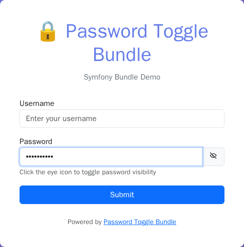
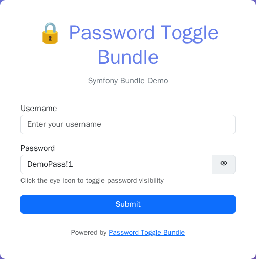

# Usage

## Table of contents

- [Screenshots](#screenshots)
- [Basic usage](#basic-usage)
- [With options](#with-options)
- [Disabling the toggle](#disabling-the-toggle)
- [Default icons (UX Icons)](#default-icons-ux-icons)
- [Styling](#styling)
- [Content Security Policy (CSP)](#content-security-policy-csp)
- [Overriding bundle templates](#overriding-bundle-templates)
- [See also](#see-also)

## Screenshots

Cropped to `<nowo-password-toggle>` (not the demo page):

| Masked | Revealed |
|--------|----------|
|  |  |

Regenerate with `make -C demo/symfony8 demo-screenshots` (REQ-DEMO-013).

## Basic usage

Use the `PasswordType` from the bundle in your form builders:

```php
use Nowo\PasswordToggleBundle\Form\Type\PasswordType;

$builder->add('password', PasswordType::class);
```

## With options

Override any default (from config) per field:

```php
$builder->add('password', PasswordType::class, [
    'toggle' => true,
    'visible_icon' => 'tabler:eye-off',
    'hidden_icon' => 'tabler:eye',
    'visible_label' => 'Show',
    'hidden_label' => 'Hide',
    'button_classes' => ['input-group-text', 'cursor-pointer'],
    'toggle_container_classes' => ['form-password-toggle'],
]);
```

## Disabling the toggle

For a specific field, render a simple password input without the toggle button:

```php
$builder->add('password', PasswordType::class, [
    'toggle' => false,
]);
```

When `toggle` is `false`, the field renders as a standard password input, compatible with any styling or JavaScript framework.

## Default icons (UX Icons)

The bundled widget `toggle_password_widget.html.twig` renders icons with `ux_icon()` (`tabler:eye-off` / `tabler:eye` by default). You need:

- **symfony/ux-icons** ^2.0 || ^3.0
- **symfony/http-client** (same Symfony major as your app)

Symfony Flex (recipe **1.2.3+**) adds both packages, copies starter SVGs to `assets/icons/tabler/`, and creates `config/packages/ux_icons.yaml`. After install, lock icons for production:

```bash
php bin/console ux:icons:lock
```

With **UX Icons 3.x**, this command scans Twig templates for `ux_icon()` usage (no icon names as CLI arguments). The recipe also ships local tabler SVGs as a fallback before the first lock.

**Without Flex**, install manually — see [Installation](INSTALLATION.md).

**If packages are missing:** the toggle still works; icons are omitted. In **dev** you may see `[icons missing]`; a one-time log warning points to `composer require symfony/ux-icons symfony/http-client`. No compile-time exception.

**Custom icons without UX Icons:** override `templates/bundles/NowoPasswordToggleBundle/Form/toggle_password_widget.html.twig` and replace `ux_icon()` with your markup (SVG, `<i>`, etc.).

## Styling

- **Option 1:** Include the bundle CSS:  
  `<link rel="stylesheet" href="{{ asset('css/toggle_password.css', 'nowo_password_toggle') }}">`
- **Web Component script:** the default widget loads `js/nowo-password-toggle.js` once per request. After `assets:install` you can also include it in the layout:

```twig
<script src="{{ asset('js/nowo-password-toggle.js', 'nowo_password_toggle') }}" defer></script>
```

The host tag is `<nowo-password-toggle>` (light DOM: native password input + toggle button). Inline `onclick` / `onkeydown` handlers are no longer used. Under a nonce-based CSP add `nonce="…"` to that tag (the widget does it automatically, see [CSP](#content-security-policy-csp)).
- **Option 2:** Import the SCSS in your build (Webpack Encore, Vite, etc.):  
  `@import '@nowo-tech/password-toggle-bundle/src/Resources/public/css/toggle_password.scss';`
- **Option 3:** Style the classes yourself: `.input-group-text.cursor-pointer`, `.form-password-toggle`, etc.

See the main [README](../../README.md#styling) for more styling details.

## Content Security Policy (CSP)

The widget never uses inline event handlers (`onclick`, `onkeydown`) or inline `style` attributes; icon visibility is a class (`is-password-visible`) styled by `toggle_password.css`. Three ways to attach the behaviour, set globally (`nowo_password_toggle.javascript`) or per field (`'javascript' => ...`):

| Mode | `<script>` emitted by the widget | Use when |
|------|-----------------------------------|----------|
| `web_component` (default) | Once per request: `<script src="…/js/nowo-password-toggle.js" nonce="…" defer>` | Classic Twig pages; works with `script-src 'self'` and with nonce-based policies (`'nonce-…' 'strict-dynamic'`). |
| `stimulus` | None | You use Symfony UX / Stimulus. The host gets `data-controller="nowo-password-toggle"`, the button `data-action="click->nowo-password-toggle#toggle keydown->nowo-password-toggle#keydown"`. |
| `none` | None | You load `nowo-password-toggle.js` yourself (AssetMapper/importmap, Encore, or your own `<script nonce>` in the layout). |

**Nonce.** In `web_component` mode the script tag carries `nonce="{{ app.request.attributes.get('csp_nonce') }}"` when that request attribute is set (attribute name: `csp_nonce_attribute`, default `csp_nonce`; `''` disables). Set it in your CSP listener before rendering, e.g. `$request->attributes->set('csp_nonce', $nonce)`, and send the same value in `script-src 'nonce-…'`.

**Stimulus.** Register the shipped controller under the configured identifier (default `nowo-password-toggle`):

```yaml
# AssetMapper: config/packages/asset_mapper.yaml
framework:
    asset_mapper:
        paths:
            vendor/nowo-tech/password-toggle-bundle/assets/controllers: nowo-password-toggle
```

```php
// importmap.php
'nowo-password-toggle-controller' => ['path' => 'nowo-password-toggle/password_toggle_controller.js'],
```

```js
// assets/bootstrap.js (Encore/Vite: import the vendor file by relative path instead)
import PasswordToggleController from 'nowo-password-toggle-controller';
app.register('nowo-password-toggle', PasswordToggleController);
```

In `stimulus` mode the host also gets `data-nowo-password-toggle-init="1"`, so a page that loads `nowo-password-toggle.js` anyway does not attach a second handler. Labels come from `data-nowo-password-toggle-visible-label-value` / `-hidden-label-value`.

If you override `toggle_password_widget.html.twig`, keep the `nonce` on any `<script>`/`<style>` you add:

```twig

<script src="…" nonce="{{ _csp_nonce }}" defer></script>
```

## Overriding bundle templates

The bundle registers its Twig views so that `@NowoPasswordToggleBundle/...` works, and it adds its view path **after** the application paths. Your overrides in **`templates/bundles/NowoPasswordToggleBundle/`** are therefore checked first.

**Using the bundle's form theme:** add the bundle's widget to your form themes (e.g. in `config/packages/twig.yaml`):

```yaml
twig:
  form_themes:
    - '@NowoPasswordToggleBundle/Form/toggle_password_widget.html.twig'
```

**To override:** create a file under `templates/bundles/NowoPasswordToggleBundle/` with the same relative path as in the bundle; Twig will use your copy instead of the bundle's.


**Example:** to override the password toggle widget, create `templates/bundles/NowoPasswordToggleBundle/Form/toggle_password_widget.html.twig`. You can copy the original from `vendor/nowo-tech/password-toggle-bundle/src/Resources/views/Form/toggle_password_widget.html.twig` and adjust as needed.

**Templates you can override:**

| Path (relative to `Resources/views/`) | Purpose |
|--------------------------------------|---------|
| `Form/toggle_password_widget.html.twig` | Form widget for the password field with visibility toggle. |

After adding or changing overrides, clear the Twig cache if needed: `php bin/console cache:clear`.

## See also

- [Configuration](CONFIGURATION.md)
- [Installation](INSTALLATION.md)
